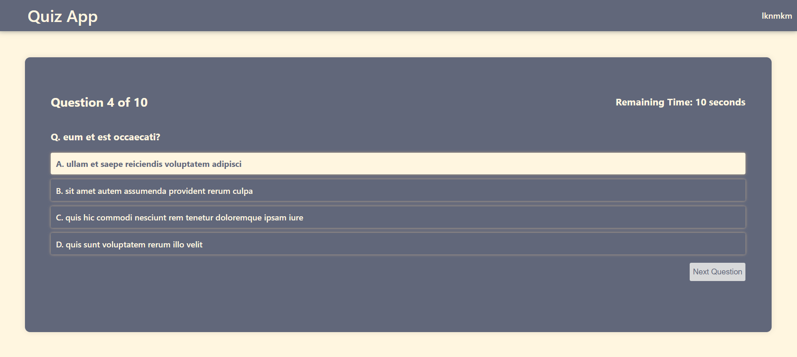
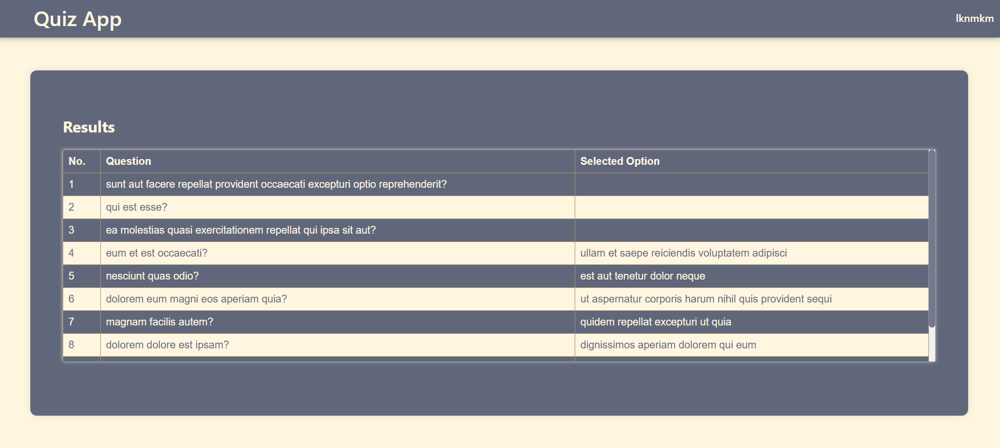

# Quiz App

This React project enables users to answer test questions according to specific conditions. Each question is allocated a certain amount of time, during which users can select their answers. The project ensures that users cannot revisit past questions and automatically proceeds to the next question when the time limit is reached. At the end of the test, the user's answers to all questions are displayed.

[For Demo](https://hazhan6.github.io/quiz-app/)

## Installation

Clone the repository:

```bash
git clone https://github.com/hazhan6/quiz-app.git

```

Go to the directory:

```bash
cd quiz-app

```

Install the dependencies:

```bash
npm install

```

Start the development server:

```bash
npm start

```

Go to http://localhost:3000 in your browser and start using the Quiz App.

## Screenshots

Here are some screenshots of the Quiz App:




